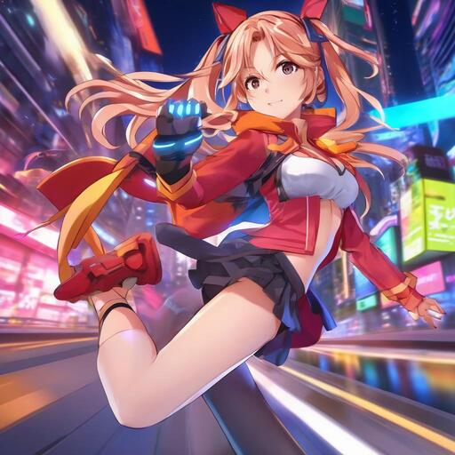
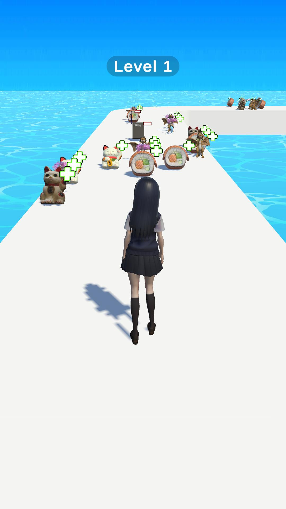
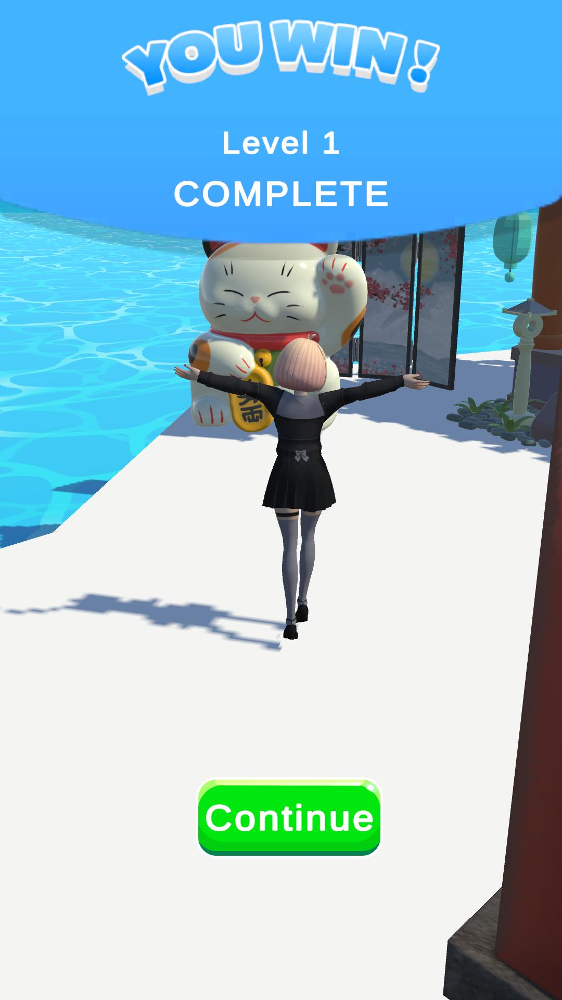
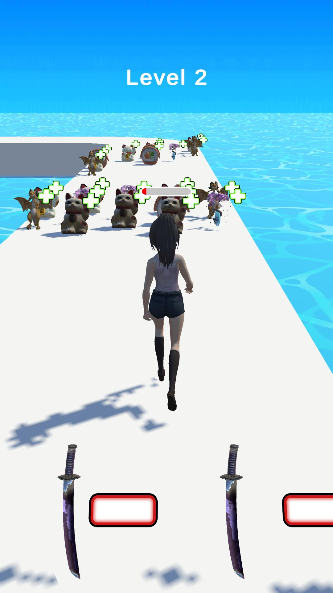

<div align="center">
  

# Run Beautiful Girl  

_Run, Collect, Upgrade with Anime Girl_

[](https://play.google.com/store/apps/details?id=elytopia.world)
[](https://www.appbrain.com/app/warehouse-keeper-box-world/com.gexetr.girlrunner)
[](https://apkpure.com/p/com.gexetr.girlrunner)
</div>

---

## How to Run

1.  **Clone the repository:**
    ```bash
    git clone --recurse-submodules https://github.com/VSobolenko/Collect-and-Run
    ```

2.  **If you forgot `--recurse-submodules`:**
    ```bash
    git submodule update --init --recursive
    ```
3. Open and Run *Assets/_Runner/Scenes/Main.unity* scene

## Unity Version  
**6000.1.12f1**  

## Description  
Run, upgrade, and play as an anime girl in this exciting runner game!  
Inspired by popular **anime-style** runner games.  

## Reference  
- [Run Rich 3D](https://play.google.com/store/apps/details?id=com.ohmgames.richtopoor)  

## Screenshots  
|  |  |  |  
|---|---|---|  

<div align="center">
  <sub>Made with ❤️ by Gexetr</sub>
</div>
